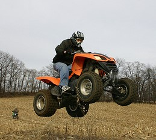
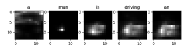
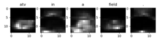

# Image_Captioning  
   

A man is riding an atv in the field .      A brown and white dog is shaking it self by water .


  Our project is to generate captions for a given image. We implemented [show attend and tell](https://arxiv.org/pdf/1502.03044.pdf) paper.

## Model:  
  ### Encoder:   
   - The Encoder encodes the image and outputs a smaller iamge(14*14) with 2048 learned which acts as the summary representaion of input  image   
   - We used 52 layered Residual Network trained on the ImageNet classification task, already available in PyTorch.
  ### Attention:
   - Attention network computes the weights corresponding to each encoded pixels which reflects the importance of that pixel in effecting the prediction of next word.
   - The weights corresponding to each pixel at a time instant are calculated using hidden state of previous time instant and the encoder output. We used soft attention where the sum of weigths of pixels add up to one.
  ### Decoder:
   - By looking at the encoded image with probabilities assigned to each pixels, last hidden it tries to predict the next word in the sequence.
   - Since generating a sequence would need recurrent neural network we used lstms.
## Results :
​                                                   
    -  


## Requirements:   
  * python 3.5+
  * pytorch 
  * Numpy
  * cuda
## Setup:  
```python
python main.py # for training
python main.py --load modelName --eval True # for testing 
```
## References:  

1. [Show attend and tell](https://arxiv.org/pdf/1502.03044.pdf)
2. [Reference for image captioning code](https://github.com/sgrvinod/a-PyTorch-Tutorial-to-Image-Captioning)

   

  
